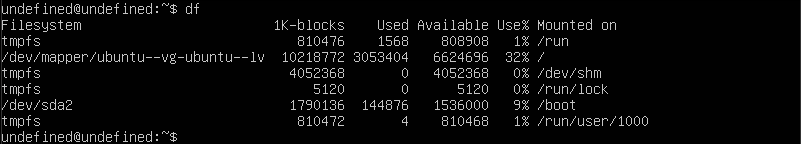
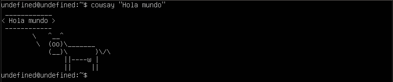

# **Comando df**
Muestra el uso del disco duro y otras informaciones como punto de montaje y sistema de ficheros.

# **Commando top**
Muestra una vista de los procesos en ejecución en tiempo real y muestra las tareas administradas por el kernel.

# **Commando cowsay**
Programa que genera una imagen ASCII de una vaca que dice el mensaje que se escribe.

